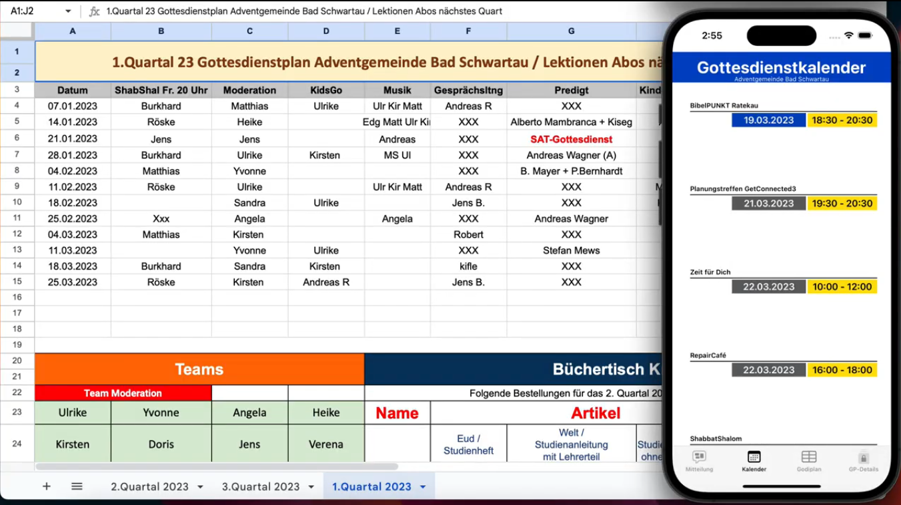

# 🙏 Knotenpunkt - Worship Service Management App

[](LICENSE)
[](https://www.apple.com/os/ios/)
[](https://www.swift.org/)
[](https://www.apple.com/os/ios/)

A professional iOS application designed to streamline church administration and enhance community engagement. **Knotenpunkt** serves as the central platform for organizing worship services, managing events, and keeping the community connected.

---
### iOS App – Video Demo

[](https://drive.google.com/file/d/1WsFMZu264yGGrlsfkju91N1-a-SWjahD/view?usp=drive_link)

---

## ✨ Features

### 🗓 Worship Schedule (Godiplan)
Full access to the service plan. See who is moderating, preaching, lead the children's moment, or helping with cleaning services.
- **Detailed Roles:** Moderation, KidsGo, Music (optional), Predigt, Putzdienst, and more.
- **Location & Time:** Get clear info on where and when each service takes place.

### 📅 Integrated Calendar
A unified view of all upcoming church events, services, and community activities.
- **Real-time updates:** Synchronized with the central database.
- **Event Details:** Start/End times, titles, descriptions, and locations.

### 🔐 Member Authentication
Secure login for church members to access internal information and personalized services.
- **Auto-login:** Stay logged in for a seamless experience.
- **Secure Backend:** Authentication handled via Google Apps Script.

### 📝 Dynamic Content
- **Excel Fragments:** Integrated viewing of spreadsheet data for administrative tasks.
- **Newspaper View:** Access community news and announcements.
- **Push Notifications:** Stay informed with important updates (Backend integrated).

---

## 🛠 Tech Stack

| Component | Technology |
| :--- | :--- |
| **Platform** | iOS (Swift) |
| **Networking** | URLSession / Reachability |
| **Backend** | Google Apps Script (Web App) |
| **Database** | Google Sheets (as lightweight DB) |
| **UI Components** | UIKit (ViewControllers, WKWebView, Storyboards) |

---

## 🚀 Getting Started

### Prerequisites
- Xcode 14.0 or newer
- iOS Device or Simulator (iOS 15.0+)

### Installation
1. Clone the repository:
   ```bash
   git clone https://github.com/your-username/iOS_Knotenpunkt.git
   ```
2. Open `Knotenpunkt.xcodeproj` in Xcode.
3. Build and run the app on your device/simulator.

---

## 🏗 Architecture
The app follows a modular iOS architecture using:
- **UIKit & Storyboards** for flexible UI layout.
- **WKWebView** for dynamic content rendering.
- **Reachability** for monitoring network connection status.

---

## 🤝 Contributing
Contributions are welcome! Please feel free to submit a Pull Request.

---
*Developed by Amir Argani*
